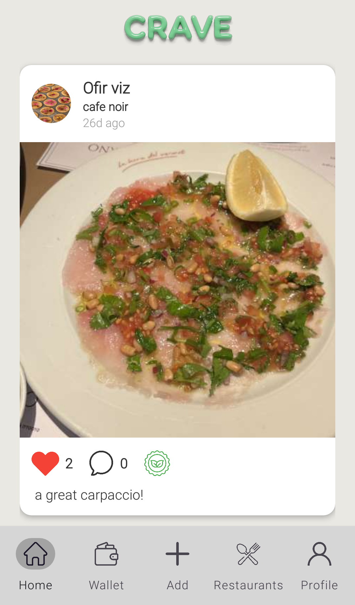
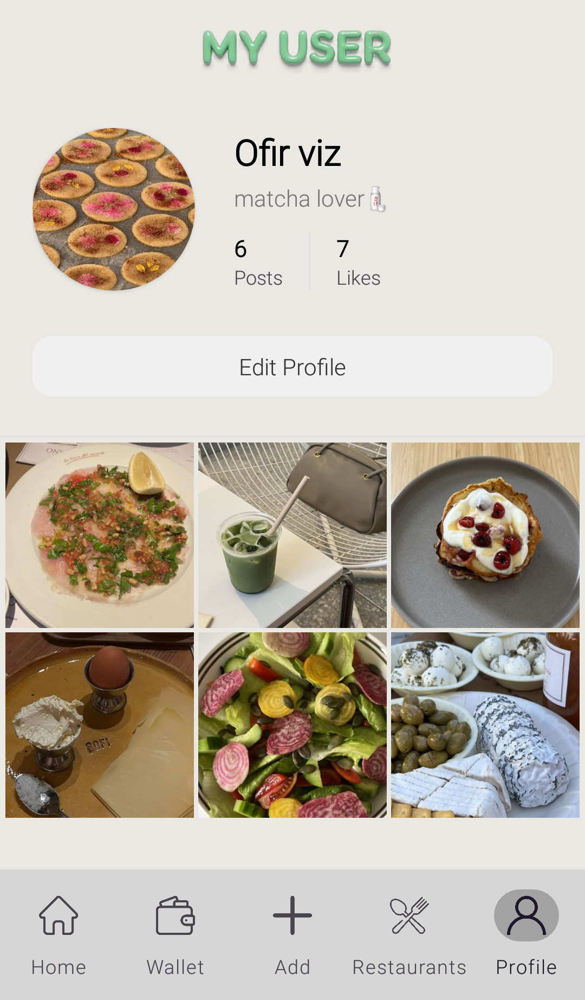
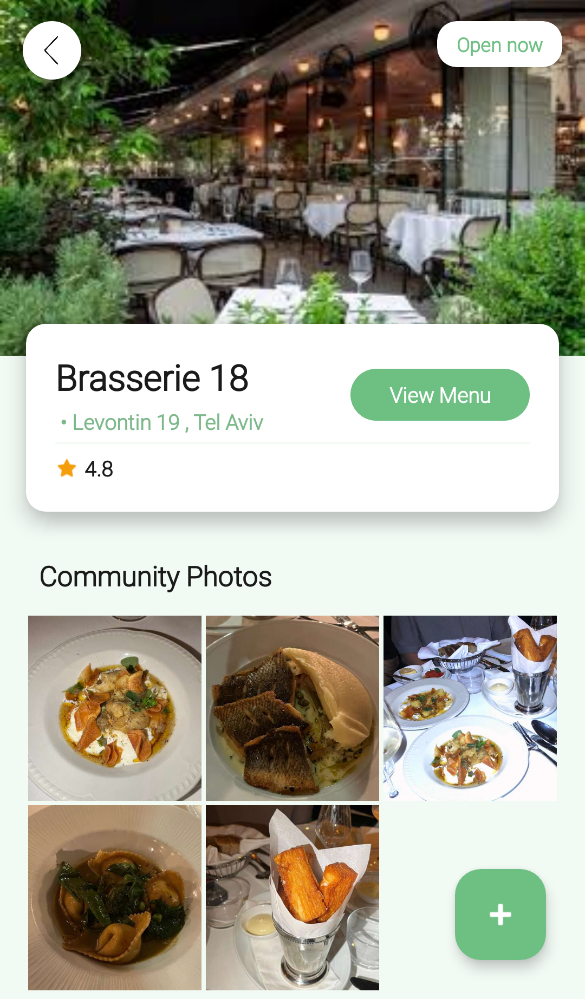
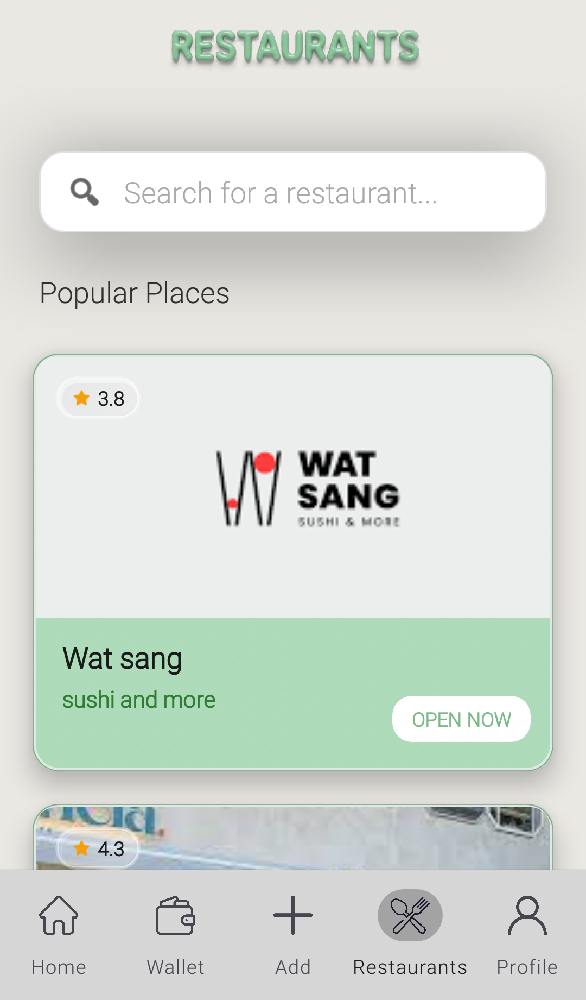
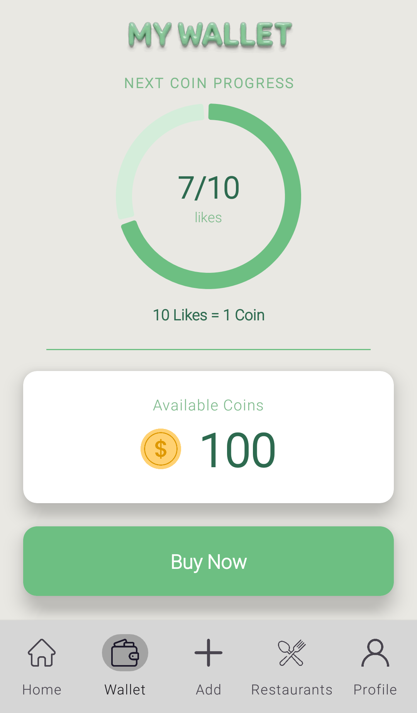
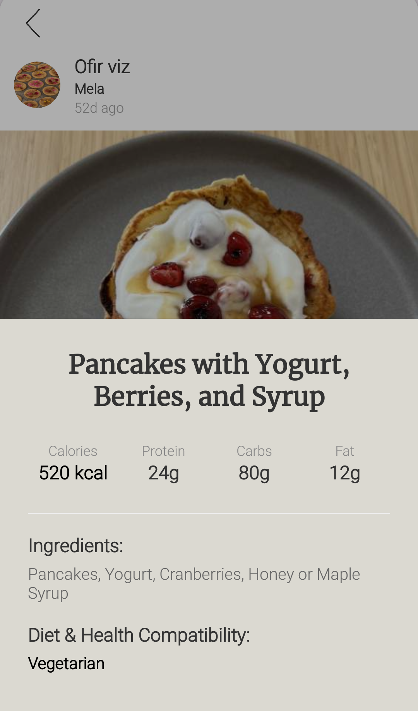

# 🍽️ CRAVE - Food Social Network

**CRAVE** is a food-focused social network centered around content creation, restaurant discovery, and rewarding user engagement. The platform allows users to share their dining experiences through photos, explore new places, and get recognized for their content.

---

## 🎯 Project Overview

The main goal of CRAVE is to create an inclusive social space in the food domain, where even users without a large following can gain visibility and value. Users visit restaurants, capture and share their meals, and earn digital coins based on the engagement their posts receive (such as likes). These coins can later be used toward future purchases.

Additionally, user-generated content may be used by participating restaurants on their social media platforms, creating a mutually beneficial collaboration between customers and businesses.
*
* **AI-Powered Analysis**: The app uses AI to analyze food images, identify ingredients, and match dishes to various dietary preferences (e.g., vegan, keto, vegetarian).
---

## 🏗️ Architecture & Structure
The project follows a clean, package-based architecture to ensure scalability and organized logic:

* **`ui`**: Contains all Activities and Fragments (Feed, Profile, Restaurant Details, and Wallet).
* **`models`**: Data classes representing system objects (`Post`, `User`, `Comment`, `MenuItem`).
* **`adapters`**: Mediators for RecyclerViews (Post Feed, Menu List, Comment Section).
* **`utils`**: Helper classes for global functions.

---

## 🛠️ Tech 
* **Language**: Kotlin
* **Database**: Firebase Firestore 
* **Image Processing**: Glide & ImageUtils
* **Animations**: Lottie Files
* **UI Components**: Material Design, BottomSheetDialogs

---

## ✨ Key Features
* **Dynamic Feed**: Real-time social feed with likes and comments.
* **Smart Restaurant Profiles**: View opening hours, and full digital menus.
* **Gamified Wallet**: Earn "Crave Coins" based on post engagement -likes. Redeem coins for unique generated coupon codes.
* **AI Integration**: Automated nutritional analysis of food posts.

---

## 🎞️ App Demo (Visuals)

### 1. Social Feed & User Profile

  
    

### 2. Restaurant Profiles 

  
    

### 3. Digital Wallet & Rewards

  

### 4. AI Food Analysis

  

---

## 🚀 Installation
1. Clone the repository: `git clone https://github.com/ofirviz12-dot/CRAVE.git`
2. Open the project in Android Studio.
3. Connect your own `google-services.json` from Firebase.
4. Build and Run on an Emulator or Physical Device.

---

**Developed by Ofir** | 2026
